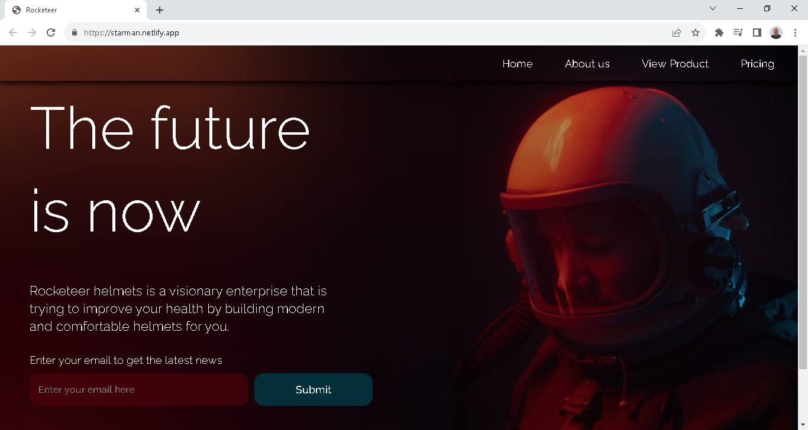

# Landing Page Astronauta

## Tecnologias Utilizadas

- HTML
- CSS

## Descrição

O objetivo deste projeto foi explorar as técnicas de desenvolvimento de uma aplicação web responsiva. Ao longo das aulas, aprendemos como utilizar o HTML e o CSS para criar uma interface que se adapte de forma adequada a diferentes tamanhos de tela.

## Autores

- [Tiago Grillo Lermy](https://github.com/TiagoGrilloLermy)

## Agradecimentos

Quero de agradecer a professora [Stephani Engell](https://github.com/StephaniEngell) por propor o desafio e ao <a href="https://rodolfomori.com.br/devclub/">DevClub<a> pelas aulas e suporte durante o desenvolvimento deste projeto.